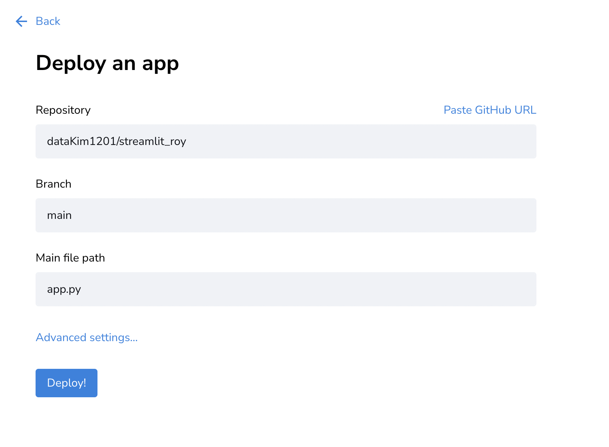

# 강의 자료를 바탕으로 Streamlit 구현 
[스트림릿](https://docs.streamlit.io/library/api-reference/widgets/st.button)
은 로컬 호스트 주소를 반환하여 적절한 데이터 분석 또는 인공지능 서비스를 올릴 수 있는 서비스입니다.

Further Reading
[여기](https://lucaseo.github.io/posts/2021-10-09-intro-streamlit-sharing/#2-github-%eb%a0%88%ed%8f%ac%ec%a7%80%ed%86%a0%eb%a6%ac-%ec%97%b0%ea%b2%b0)링크를 참조해 보니 실제 배포 까지 할 수 있는 것을 확인했습니다.

👩🏻‍💻 깃 레포로 스트림릿 배포 하기!
1. [깃허브 계정과 스트림릿 연결](https://share.streamlit.io/)로 들어가셔서 깃헙으로 가입하시면 됩니다!

보시는 것 처럼 깃허브로 가입을 하시고 

`New app` 을 눌러주세요
2. deploy하기

- Repository : 현재 가입한 계정의 repository를 선택 -> 구현 해두신 파일을 레파지토리에 올린 상태에서 실행 가능합니다.
- Branch : 해당 레파지토리에서 업로드 하고 싶은 브랜치를 선택 (기본은 아마 main or master 입니다.)
- main file path : 이 부분이 헷갈리실 수 있는데 기존 CLI 환경에서 `streamlit run file.py` 하는 파일을 지정해주시면 됩니다.!!

📌 주의할 점 1
단순 웹페이지가 아닌 파이썬 모듈이 포함된 배포버전이다 보니 꼭 requirments.txt를 명시해주어야 합니다. 파일 명도 똑같이 구성해야 배포시 화면에 잘 나오는 것을 확인해 보실 수 있습니다!

📌 주의할 점 2
Advanced settings에서는 TOML언어로 데이터 관련 세팅을 하실 수 있고 또 개발 하셨던 환경에 맞게 파이썬 버전도 설정 할 수 있습니다!

제가 완성한 스트림릿으로 배포한 사이트는
[여기](https://datakim1201-streamlit-roy-app-cwca53.streamlit.app)입니다.